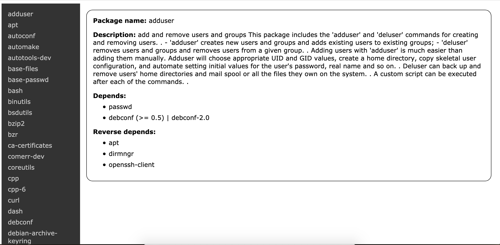

# 

# PkgInfo - web app
<table>
<tr>
<td>
  This simple web application reads information about installed packages of 
  a Debian and Ubuntu system
  and displays key package information.
</td>
</tr>
</table>

## How to parse package information

You must first compile the parser by running `make build-parser`. Parsing the package information can then be made by running `make parse`. 

## How to build

_Note: Before building the project, make sure you have parsed the package information._ 

The project uses TypeScript, PostCSS and Browserify. Source files in src folder can be compiled using the command `make build`. This command also runs the Browserify plugin that converts the compiled dist/client code into a JavaScript bundle for the frontend into public_html/app-bundle.js. 

## How to start the server

To start the server, run `make run` or if you wish the server to recompile and restart on source file changes, run `make watch`.

## How to Dockerize

In order to create a docker image of the project named "package-information-reader", run the command `make build-docker-image`. The image can then be run in a background mode by running `make run-docker-image` or in a interactive debug mode by running `make debug-docker-image`. The server will be listening by default in address http://localhost:3000. 

## Technologies
* Node.js
* Typescript
* PostCSS
* HTML
* Docker
* Heroku
* Makefile

## Site
https://package-information-reader.herokuapp.com

